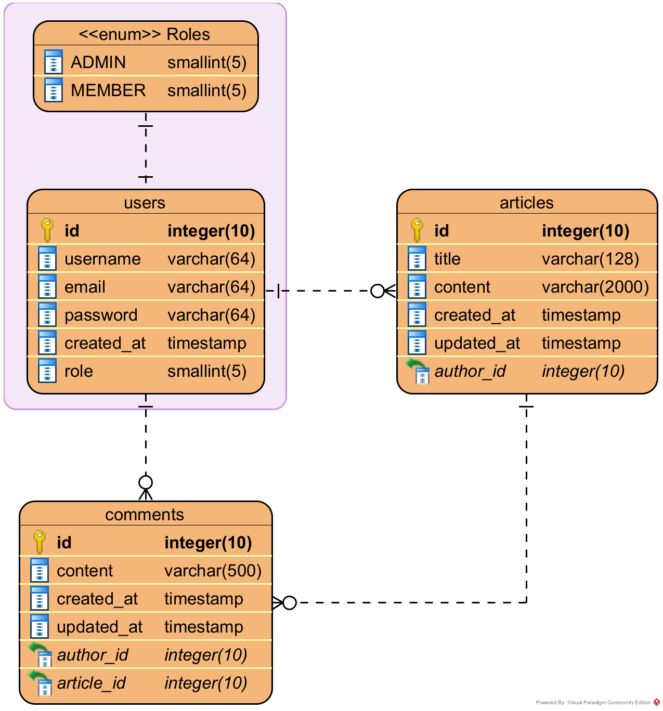

# About
This project is meant to finish the quest to join the BNCC Community Bootcamp.

It's a backend JSON REST API for article website. It's written in TypeScript Node.js and the express.js backend framework. This project is meant for a programming article website, hence why you see the `seeder.ts` file has the topic of programming.

#### ERD


#### Features
1. Article CRUD (Create, Read, Update, and Delete).
1. Comments within the article, and of course it's CRUD too (Create, Read, Update, and Delete)
1. Permission-based routes, not all routes can be accessed by just anyone and it could only be for the **admin**.
1. User authentication using JSONWebToken.
1. ESLint, to me code is an art so I like clean code, it's to enforce myself to keep the consistency in the code and keep it clean.
1. TypeORM to use the database with ORM (Object-Relational Mapping), with this I don't need to insert SQL syntax to my code, which... could have many typos I believe. I would use Prisma if I could, but I haven't learn to use it yet.
1. PostgreSQL database.

#### Roles
1. **Admin**, can access everything and do everything such as:
   * Post, edit, read, and delete articles
   * Post, edit, read, and delete comments
1. **Member**, the user who visits the website and is registered, they can:
   * Read articles
   * Post, edit, read, and delete comments

## Quick Start
1. Make sure you have installed [yarn](https://classic.yarnpkg.com/lang/en/).
1. Make sure to also install [PostgreSQL](https://www.postgresql.org/download/)
1. Clone the repo
   ```sh
   git clone https://github.com/Alviannn/B-Com_Quest_Alvian-Daru-Quthni.git
   ```
1. Install the dependencies
   ```sh
   yarn install
   ```
1. Duplicate the `.env.example` file to `.env` and fill the database credentials
1. Generate JWT secrets
   ```sh
   yarn jwt:generate
   ```
1. If you want to generate the initial data (or seed the data)
   ```sh
   yarn seed
   ```
1. Run the dev server
   ```sh
   yarn dev
   ```

## Commands
Running:
```sh
# compiles the project to `dist` directory
yarn compile

# starts the program (must be compiled first)
yarn start

# automatically compiles and starts the program (not used in production)
yarn dev

```

Cleans the compiled files (in `dist` directory):
```sh
yarn clean
```

Linting:
```sh
# runs ESLint to `src` directory
yarn lint

# fixes ESLint errors (for fixable errors only)
yarn lint:fix
```

Seeding data:
```sh
# generates initial data to the database
yarn seed
```

JSONWebToken:
```sh
# generate JWT secrets (both access and refresh secrets)
yarn jwt:generate
```

## Environment Variables
Found in the `.env` file
```sh
# the JWT secrets
JWT_ACCESS_SECRET=

# the postgres database credentials
DB_HOST=
DB_PORT=5432
DB_DATABASE=
DB_USERNAME=
DB_PASSWORD=
```

## Project Structure
```
<your project>\
 |--scripts\             # User scripts for automating
 |--src\                 # Source folder
     |--configs\         # Application configs
     |--controllers\     # Route controllers
     |--entities\        # Database models/entities (represents table)
     |--middlewares\     # Custom middlewares
     |--routes\          # Server routes
     |--utils\           # Utility classes and functions
         |--api.util.ts  # Server response utility
     |--validations\     # Schemas for validating JSON
     |--app.ts           # Express app and it's configuration
     |--ormconfig.ts     # TypeORM config
     |--server.ts        # Program entry point (db connection is also here)
 |--.eslintrc.json       # ESLint config
 |--tsconfig.json        # TypeScript compiler config
 |--...
```